# Architecture

High-level map of how the Quadrature Domain Solver app fits together.
For mathematical content, see [THEORY_MAP.md](THEORY_MAP.md). For how
to extend the app, see [CONTRIBUTING.md](CONTRIBUTING.md).

> **✅ ESM migration COMPLETE (suite Phase 2).** This app is now **ES-module-only** and Vite-built:
> `app/index.html` loads `main.mjs` (a native module + native-module-worker graph), and `vite build`
> emits a static `dist/`. The classic frozen-`.js` copies and the no-build, `window.QD`-only load
> model described **below are HISTORICAL** — the subsystem *map* is still an accurate conceptual guide,
> but the *mechanism* details (vanilla `.js`, "no build step", a global `window.QD` as the only entry)
> are superseded by the `.mjs` graph. Current build + what changed: [ESM-MIGRATION.md](ESM-MIGRATION.md)
> and the suite root `CLAUDE.md` status. (Review XCUT-hygiene-01)

## At a glance

- **ES modules, Vite-built** — `app/index.html` loads `main.mjs`; `vite build` (root `app/`)
  emits a static `dist/`. In dev, `vite` serves `app/` with HMR. _(Historically vanilla HTML+JS
  with no build step — see the banner above.)_
- **Single namespace** — `window.QD` holds every public function, type,
  and subsystem — modules `import` the mutable `QD` object and attach onto it.
  ES-module consumers can also use the [`app/qd.mjs`](app/qd.mjs) barrel.
- **Lazy-mount tabs** — Schwarz, Sphere, and Param-slice UIs mount
  their controls only when their tab is first activated, keeping
  startup cheap.
- **Web Workers for heavy compute** — the Inverse-tab primary solve
  runs on a single warm worker (P0.2); the Parameter-slice tab spawns
  a pool of workers (one per `navigator.hardwareConcurrency` core).
  Both are **native ES-module workers** (`new Worker(new
  URL('./workers/*-entry.mjs', import.meta.url), {type:'module'})`); Vite
  bundles each worker's import graph into its own chunk.
- **GPU rendering for Schwarz / Sphere** — WebGL 2 fragment shaders;
  Float32 throughout. CPU fallback ships in every adapter.

## Module import graph

`app/index.html` loads a single `<script type="module" src="./main.mjs">`.
`main.mjs` side-effect-imports the whole graph, then calls `QD.Strings.apply()`.
Modules cross-reference each other by `import`ing the mutable `QD` namespace that
`solver.mjs` default-exports and attaching onto it. The layering below is
conceptual (ES-module resolution handles the actual ordering):

```mermaid
flowchart LR
  M0[main.mjs]
  subgraph CDN
    A1[math.js 12.4.1]
    A2[KaTeX 0.16.47]
  end
  subgraph Math["Math primitives"]
    B1[complex.mjs]
    B2[taylor.mjs]
  end
  subgraph Solver["Solver core (registers families on QD)"]
    C1[solver.mjs]
    C2[solver-faber.mjs]
    C3[solver-qd.mjs]
    C4[solver-uqd.mjs]
    C5[solver-lqd-common.mjs]
    C6[solver-lqd.mjs]
    C7[solver-lqd-singular.mjs]
    C8[solver-uqd-lqd.mjs]
    C9[solver-uqd-lqd-singular.mjs]
  end
  subgraph Utility
    D1[parse-h.mjs]
    D2[critical-set.mjs]
    D2a[univalence.mjs]
    D2b[cusps.mjs]
    D2c[solver-cmax.mjs]
    D3[primary-solution.mjs]
    D4[primary-solver-worker.mjs]
  end
  subgraph Tabs["Tab subsystems"]
    E1[direct/direct-common.mjs]
    E2[schwarz/schwarz-common.mjs]
    E3[schwarz/schwarz-webgl.mjs]
    E4[param-slice/param-slice-common.mjs]
    E5[param-slice/param-slice-pool.mjs]
  end
  subgraph UI["UI layer"]
    F1[qol.mjs]
    F2[ui-presets.mjs]
    F2b[ui-state.mjs]
    F3[ui-domain-plot.mjs]
    F2c["ui-modes / ui-pole-grid / ui-h-text / ui-solve / ui-url-state"]
    F4[ui.mjs]
    F5a["direct/direct-recompute / direct-verify"]
    F5[direct/direct-ui.mjs]
    F6a["schwarz/schwarz-paint / schwarz-render / schwarz-features / schwarz-interaction"]
    F6[schwarz/schwarz-ui.mjs]
    F7a[param-slice/param-slice-render.mjs]
    F7[param-slice/param-slice-ui.mjs]
  end
  subgraph Sphere["Sphere (lazy adapter)"]
    G1[sphere/sphere-common.mjs]
    G2[sphere/sphere-webgl.mjs]
    G3[sphere/sphere-ui.mjs]
  end

  M0 --> Math
  CDN --> Math --> Solver --> Utility --> Tabs --> UI --> Sphere
```



Registration order still matters — every solver-family module calls
`QD.registerFamily('X')` at load — but it now falls out of the `import` graph:
`solver.mjs` is imported (and so runs) before any family module that depends on
it. The worker-thread barrel [`app/workers/solver-graph.mjs`](app/workers/solver-graph.mjs)
also imports the solver cluster in that order for the native module workers.

The diagram is illustrative, not exhaustive. The Utility layer also loads several
page-only analysis modules not drawn above: `observables.mjs`, `symmetry.mjs`,
`thesis-examples.mjs`, `faber-analysis.mjs`, and **`ui-strings.mjs`** (imported
before `thesis-examples.mjs`, which reads `QD.Strings.blurbs` at load).
`ui-strings.mjs` defines `QD.Strings` (the editable-prose source of truth); `main.mjs`
calls its `apply()` after importing the graph to fill `[data-str*]` elements before paint.

## Public `QD.*` surface

| Group | Exports |
| --- | --- |
| Math primitives | `Complex`, `Taylor` |
| Solver core | `evalPhi`, `phiTaylorAt`, `residual`, `residualNorm`, `packPhi`, `unpackPhi`, `newtonSolve`, `solveInverseQD`, `searchAlternates`, `isBoundaryUnivalent`, `sampleBoundary`, `sampleBoundaryAdaptive`, `binomialCoeff`, `selectFamily`, `registerFamily`, `packPhiBySchema`, `unpackPhiBySchema`, `applySchemaClamps` |
| Linear algebra (P1.2) | `solveLinearSystem`, `solveLeastSquares`, `houseQR`, `numericalJacobian` |
| Inverse Faber | `QD.Faber.inverseFaberAtPole`, `QD.Faber.inverseFaberAtInfinity` |
| Faber polynomials (forward) | `QD.FaberAnalysis.{faberPolynomials, faberPolynomial, polynomialRoots, formatFaberPoly, faberConvergence}` — Faber polynomials of the complement of a classical UQD + a Durand–Kerner complex root-finder (`faber-analysis.mjs`) |
| Direct problem | `QD.Direct.*` (see [`app/direct/README.md`](app/direct/README.md)) |
| Schwarz dynamics | `QD.Schwarz.*` (see [`app/schwarz/README.md`](app/schwarz/README.md)) |
| Riemann sphere | `QD.Sphere.*` (see [`app/sphere/README.md`](app/sphere/README.md)) |
| Critical set | `QD.findCriticalPoints`, `QD.CriticalSet.*` |
| Geometric properties | `QD.classifyUnivalence`, `QD.Univalence.classifyUnivalence` |
| Boundary cusps | `QD.classifyCusps`, `QD.Cusps.classifyCusps` |
| Max conformal radius | `QD.estimateMaxConformalRadius` (unbounded c\*; bracket+bisection with a two-regime gate — genuine-QD identity away from the cusp, cusp criterion `max\|z\|` over φ′ zeros near it; returns `mechanism` cusp/fold — `solver-cmax.mjs`) |
| Custom h(w) text | `QD.parseH`, `QD.formatH` |
| Editable UI prose | `QD.Strings.{help, familyHints, hints, tooltips, notes, faber, oracle, blurbs, guidance, get, apply}` — single source of truth for descriptions/helptext/tooltips/blurbs; `apply()` injects static HTML into `[data-str]`/`[data-str-html]`/`[data-str-title]` elements (`ui-strings.mjs`; see `HELPTEXT.md`) |
| Cross-tab envelope (P0.1a) | `QD.PrimarySolution.{get, hasSolution, subscribe, publish, update, clear}` |
| Warm worker (P0.2) | `QD.PrimarySolverWorker.{ensureReady, solve, cancel, isBusy, searchAlternates, cancelAux, isAuxBusy}` |
| Family registry | `QD.Family.boundedQD`, `QD.Family.unboundedQD`, `QD.Family.boundedLQD`, `QD.Family.boundedLQD_singular`, `QD.Family.unboundedLQD`, `QD.Family.unboundedLQD_singular` |

## Tab → DOM ownership

| Tab | Container | UI script | Public adapter |
| --- | --- | --- | --- |
| QD (Inverse + Direct) | `#controls-qd` + shared `#canvas` | `ui.mjs`, `direct/direct-ui.mjs` | publishes `QD.PrimarySolution` |
| Schwarz dynamics | `#controls-schwarz` + own GL canvas overlay | `schwarz/schwarz-ui.mjs` | subscribes `QD.PrimarySolution`; toggles to Sphere |
| Sphere view | mounted inside Schwarz panel | `sphere/sphere-ui.mjs` (`QD.SphereView.mount`) | shares Schwarz's `phiSnapshot` |
| Parameter slice | `#controls-param-slice` | `param-slice/param-slice-ui.mjs` | reads `window.QD_UI.snapshotScenario`; pushes back via `loadScenarioIntoQdTab` |

## Key cross-cutting contracts (P0/P1 work)

### `QD.PrimarySolution` envelope (P0.1a)

Cross-tab pub/sub for the current inverse-solver result. Schwarz /
Sphere / Param-slice subscribe to this envelope rather than reaching
into `ui.mjs`'s internal `state.current`.

```js
QD.PrimarySolution.subscribe(handler);   // tabs subscribe
QD.PrimarySolution.publish(envelope);    // ui.mjs writes after each solve
const env = QD.PrimarySolution.get();    // snapshot read
```

Source: [`app/primary-solution.mjs`](app/primary-solution.mjs). Envelope
shape is the same `{ success, primary, alternates, hData, w0Used,
cUsed, unbounded, attempts, criticalSet }` previously held on
`state.current`. The JSDoc `@typedef PrimaryEnvelope` at the top of
that file is the source of truth.

### `QD.PrimarySolverWorker` (P0.2)

Single warm Web Worker for the Inverse-tab solve. Keeps the multistart
pipeline (50–500 ms for hard h's) off the main thread. Source:
[`app/primary-solver-worker.mjs`](app/primary-solver-worker.mjs).

```js
const result = await QD.PrimarySolverWorker.solve(hData, opts);
```

Preemption: if a new `solve()` arrives while one is in flight, the
worker is **terminated and recreated**. This is the cheapest way to
interrupt deeply-nested Newton iteration; the resulting solve rejects
with `{ aborted: true, superseded: true }`. Token-gating in `ui.mjs`
(`_solveAndRenderToken`) discards stale results that arrive after a
newer call. `ui.mjs` also surfaces a **Cancel** button during a solve
that calls `cancel()` and bumps the token.

The same module hosts a **dedicated aux worker** for the background
alternate-solution search (`searchAlternates` / `cancelAux`): a second
Worker instance from the same bundle, so a long alt-search never queues
behind or preempts an interactive primary solve. `ui.mjs`'s
`startBackgroundAltSearch` drives it as an async loop instead of the old
synchronous `setTimeout` chunks (which janked the 2D plot).

### URL/hash state (B1)

`ui.mjs` serializes the user-meaningful config — `{mode, h(w) text,
w0(mode), c, α, q, aggressiveness, tab}` — into `location.hash` via
`writeUrlState` (`history.replaceState`, rAF-coalesced) on each solve and
tab switch, and restores it on load via `applyUrlState`. The h-text
round-trips both the poles and the polynomial part (`formatH` ⇄
`parseH`), so it alone reproduces the quadrature data. This makes a
configuration bookmarkable, shareable, and reload-restorable.

Fallback: if `Worker` is unavailable (e.g. Node / no-Worker), `solve()`
runs `QD.solveInverseQD` on the main thread inside a microtask. Logged once
at `console.warn`.

### `window.QD_UI.installDomainPlot(deps)` (P0.1b)

`DomainPlot` lives in [`app/ui-domain-plot.mjs`](app/ui-domain-plot.mjs)
as a factory function, so the class can be its own module while still
receiving the four `ui.mjs` closures it needs:

```js
const DomainPlot = window.QD_UI.installDomainPlot({
  state, modeDescriptor, formatTick, sub,
});
const plot = new DomainPlot(canvasEl, readoutEl);
```

#### `QD_UI.installX(uiCtx)` — the Inverse-tab module split (Phase 3, item E)

The Phase-3 UI modularization carved the 3024-line `ui.mjs` down to ~1580 by
moving cohesive clusters into sibling factory modules, all on the same pattern:

| Module | Responsibility |
| --- | --- |
| [`app/ui-modes.mjs`](app/ui-modes.mjs) | `MODES` descriptor table + aggressiveness `PRESETS` + `modeDescriptor`/`currentPresetList` |
| [`app/ui-pole-grid.mjs`](app/ui-pole-grid.mjs) | `renderPolesList` / `renderPolyCoefList` (the pole + poly-coef DOM builders) |
| [`app/ui-h-text.mjs`](app/ui-h-text.mjs) | the `#h-text` ⇄ structured-grid mirror (`parseAndApplyHText`, `refreshHText`, `modeAllowsPoly`) |
| [`app/ui-solve.mjs`](app/ui-solve.mjs) | the solve→render→analyze pipeline (`solveAndRender`, `showSolution`, the geom/cusp/realizability analysis, alternates, background search) |
| [`app/ui-url-state.mjs`](app/ui-url-state.mjs) | `writeUrlState` / `applyUrlState` (B1 hash serialize+restore) |

`ui.mjs` builds ONE shared mutable context object, `uiCtx`, carrying the closures
the modules need (`state`, the descriptor tables, DOM helpers, the small shared
render helpers `escapeHTML`/`formatExp`/`setStatus`, the hData/option builders,
`plot`, …). Each module is `QD_UI.installX(uiCtx)` and returns its public
functions; `ui.mjs` captures them into local bindings with their **original
names**, so every existing call site is unchanged:

```js
const { MODES, PRESETS, modeDescriptor, currentPresetList } =
  window.QD_UI.installModes(uiCtx);
// …later, after every dependency is on uiCtx…
({ solveAndRender, showSolution, refreshAlternatesPanel, /* … */ } =
  window.QD_UI.installSolve(uiCtx));
```

Two rules keep it correct:
- **Install where the deps exist.** Each module is installed at the point in
  `ui.mjs` where everything it destructures is already on `uiCtx` (modes early,
  after `buildW0`; the rest at the tail, after all helpers are defined). Bodies
  destructure their deps at the factory top, so the moved code is verbatim.
- **Cross-module peers go through `uiCtx` at call time.** When module A calls a
  function that lives in module B (which may install later), it reads
  `ui.fn()` at call time rather than destructuring at install — e.g.
  `ui-solve`'s `solveAndRender` calls `ui.writeUrlState()`. Within a module,
  all calls stay bare (which is why the coupled solve/output/analysis cluster is
  one module — its shared `_solveAndRenderToken` and mutual calls never cross a
  seam).

Same pattern works for any future class or cluster extraction.

#### `QD_UI.installSchwarzX(sCtx)` — the Schwarz-tab module split (Phase 3, item E)

The same modularization carved the 2477-line `schwarz/schwarz-ui.mjs` down to
~1215 by moving four cohesive clusters into sibling factory modules. The only
twist vs. the Inverse-tab split is that `schwarz-ui.mjs` is an **IIFE**, so the
host uses forward-`let` bindings inside the IIFE (`let paintAll, …;`) that the
install assignments fill in — the captured names are then called bare
everywhere else in the IIFE.

| Module | Responsibility |
| --- | --- |
| [`app/schwarz/schwarz-paint.mjs`](app/schwarz/schwarz-paint.mjs) | the 2D-canvas output layer: `clearCanvas` / `paintAll` / `repaintField` / `paintBoundaryOnTop` / `paintOrbit` / `paintPreimageTree` / `paintLimitSet` / `setProgress` + the colormaps |
| [`app/schwarz/schwarz-render.mjs`](app/schwarz/schwarz-render.mjs) | the progressive escape-time renderer: debounced `requestRecompute` + `doRecompute` + the CPU 4×4→2×2→1×1 pyramid (GPU path is one synchronous frame) |
| [`app/schwarz/schwarz-features.mjs`](app/schwarz/schwarz-features.mjs) | the per-feature compute/recompute routines wired to the analysis / limit-set / forward-dynamics cards: σ domain-coloring, preimage-tree rebuild + stats, limit-set chaos game, σ level curves, critical orbits, cycle finder, orbit sweep, z-panel ψ-pullback, and high-res PNG export |
| [`app/schwarz/schwarz-interaction.mjs`](app/schwarz/schwarz-interaction.mjs) | canvas hover / wheel / click / dblclick / pin handlers + `attachCanvasHandlers` (incl. the single-click `CLICK_DELAY` pin timer, exposed via `get/setClickDelay` for the test hook) |

`schwarz-ui.mjs` builds ONE shared mutable `sCtx` (`sState` + the geometry/GPU
helpers + the KIND_* constants) and installs in dependency order at the tail:
**paint → render → features → interaction** — each installed once its `sCtx`
deps exist (render needs the paint fns; interaction destructures the feature
recompute hooks `_recomputeLevelCurves` / `_recomputeDomainColoring` /
`_recomputeZPanelOrbit` / `_refreshPreimageTreeStats`). What **stays** in
`schwarz-ui.mjs`: `sState` + constants, the lazy sidebar mount + the card
builders, `setMode` / view-toggle, the φ-capture + GPU-init plumbing, and the
coordinate transforms / `renderImmediate` that several modules share via `sCtx`.

#### `QD_UI.installDirectX(dCtx)` — the Direct-tab module split (Phase 3, item E)

The 1662-line `direct/direct-ui.mjs` (also an IIFE) was carved to ~1063 by moving
the two heaviest clusters into sibling factory modules:

| Module | Responsibility |
| --- | --- |
| [`app/direct/direct-recompute.mjs`](app/direct/direct-recompute.mjs) | the recompute→render pipeline: `recomputeAndRender` + `recomputeBounded`/`recomputeUnbounded`/`recomputeNumerical` + `displayH` + `sampleBoundedPhi` + `pushBoundaryToPlot` |
| [`app/direct/direct-verify.mjs`](app/direct/direct-verify.mjs) | the **Verify** button: `runVerify` + `sampleAnalyticPhi` |

`direct-ui.mjs` builds ONE shared `dCtx` (`{ directState, parseComplex, isMounted }`)
and installs both at the tail (`({ recomputeAndRender } = QD_UI.installDirectRecompute(dCtx))`,
`({ runVerify } = QD_UI.installDirectVerify(dCtx))`), capturing the returns into
forward-`let` bindings so the card-builder handlers + `_activate` call them
unchanged. The two modules are independent (neither calls the other), so install
order between them is free. What **stays** in `direct-ui.mjs`: `directState`, the
mount/activate API, the Domain-type + φ-input + output card builders, the
coeff-field builders, the paste/expression-parse wiring, and the shared
`parseComplex` / `coeffToString` / `section` helpers (retained handlers use
them). The host's mount flag is read inside the moved `recomputeAndRender` via
the `dCtx.isMounted()` accessor — the one non-verbatim line, since a primitive
can't be shared by value.

#### `QD_UI.installParamSliceRender(psCtx)` — the Param-slice split (Phase 3, item E)

The 1396-line `param-slice/param-slice-ui.mjs` (also an IIFE) was carved to ~1096
by lifting its one heavy compute cluster — the adaptive 2-D render engine — into
[`app/param-slice/param-slice-render.mjs`](app/param-slice/param-slice-render.mjs).

That module is a single function, `runAdaptive2D`: the progressive quadtree sweep
(coarse stride pass → stride/2 refinement of only the cells whose corners
disagree → nearest-neighbour coverage fill), plus the warm-hint **spatial index**
(bucketed `insertPhi`/`nearestPhi`, published on `sliceState` so the hover preview
warm-starts) — all nested inside it. Every per-run input (the worker `pool`, the
`paintCellBlock`/`paintImage`/`onProgress` callbacks, `cancelToken`, axes/grid
dims) arrives via its single options argument, so the only cross-seam deps are
`sliceState` and the `cancelLiveSolve` host hook, passed via
`psCtx = { sliceState, cancelLiveSolve }`. `param-slice-ui.mjs` captures
`runAdaptive2D` into a forward-`let` and calls it from `startRun` unchanged; the
`sliceState`, card builders, canvas interaction, and run orchestration stay.

### `qd.mjs` ESM façade (P1.1)

[`app/qd.mjs`](app/qd.mjs) re-exports the entire public `QD` surface as
named ES-module exports:

```js
import { Complex, solveInverseQD, PrimarySolution } from './qd.mjs';
```

It originated (P1.1) as the leaf of a 5-stage plan to migrate the app off
classic `<script>` globals; that migration is now **complete** (the whole app
is ESM — see the banner + [ESM-MIGRATION.md](ESM-MIGRATION.md)), so `qd.mjs`
is simply a convenience barrel over the `QD` surface.

## Algebra module (the symbolic track)

The **Algebra tab** is a self-contained four-layer stack for setting up and reducing the
polynomial system that decides existence/uniqueness of a classical bounded quadrature
domain. Data flows one way; all exact math lives at the bottom.

```
 generators                 store (DOM-free)          view                 heavy ops
 ───────────                ────────────────          ────                 ─────────
 qd-equations.mjs ─┐                                 algebra-canvas.mjs
 (●/★/gauge system)├─seed→  algebra-store.mjs ─render→ (QD.AlgebraCanvas:   sym-worker.mjs
 qd-constraints.mjs┘        (QD.AlgebraStore:          column lanes,        (QD.SymWorker:
 (univalence forms)         append-column audit       SVG edges, verdict)  module worker;
                            trail DAG of equation                           groebner/solve/
                            nodes; reductions;     ↑drive│ ↑select          dimension; main-
 sym-core.mjs ◀──all exact  classify/solve/factor) │     │                 thread fallback)
 (QD.Sym: ℚ(i),  math       │        ▲              algebra-ui.mjs
  MPoly, Gröbner,           └────────┘              (QD_UI.installAlgebra:
  solvers, factor)            offload heavy ops      node-editor sidebar,
                              ────────────────▶      inspector, toolbar,
                                                     breadcrumb, exports)
```

- **`sym-core.mjs` (`QD.Sym`)** — exact Rational/Gaussian(ℚ(i))/MPoly, Gröbner/FGLM/zero-dim
  solvers, Hermite real-solution counting, Wu triangularization, and `factor`. No DOM, no deps.
- **`qd-equations.mjs` / `qd-constraints.mjs`** — generate the (●)/(★)/gauge system and the
  univalence constraints (the `{poly, rel, label, meta}` node specs the store seeds from).
- **`algebra-store.mjs` (`QD.AlgebraStore`)** — DOM-free model: an **append-column audit-trail
  DAG** (column 0 = original; each reduction appends a labeled column), plus analysis
  (`classify`/`solve`/`dimension`/`factorOf`/`applyFactor`) defaulting to the *current* (last)
  column. Heavy ops route through `sym-worker.mjs`.
- **`algebra-canvas.mjs` (`QD.AlgebraCanvas`)** — renders the store as structured column lanes
  (sticky headers, arrowed SVG edges, zoom); exposes `scrollToColumn`/`fitWidth`/`setVerdict`.
- **`algebra-ui.mjs` (`QD_UI.installAlgebra`)** — the node-editor sidebar + inspector + floating
  toolbar + breadcrumb; drives the store and reads selection back from the canvas via `onSelect`.

**Provenance-op contract** (the one cross-layer coupling to know): every store reduction stamps
`provenance.op` ∈ `{generate, conjugate, resultant, groebner, constraint, duplicate, substitute,
linear-reduce, assume-real, fix-w0, triangular, factor}`, and `algebra-ui.mjs`'s `provText` +
`columnLabel` switch on exactly those strings — a new reduction op must be added in **both** the
store (emit) and the UI (render), or its column shows as a bare "column N". See the headers of
`algebra-store.mjs` and `algebra-ui.mjs`, and the THEORY_MAP rows for the per-feature function→file
index.

## Worker bundles

Both Worker subsystems (`primary-solver-worker.mjs`,
`param-slice/param-slice-pool.mjs`) spawn **native ES-module workers**:

1. `new Worker(new URL('./workers/<name>-entry.mjs', import.meta.url),
   { type: 'module' })` from the main-thread twin.
2. The `*-entry.mjs` imports the shared solver barrel
   [`app/workers/solver-graph.mjs`](app/workers/solver-graph.mjs), so the whole
   solver graph loads in the worker by normal ES-module resolution.
3. The entry runs a `self`-guarded `onmessage` handler; Vite bundles each
   entry's import graph into its own chunk at `vite build`.

Adding a solver file to the workers means importing it in
`workers/solver-graph.mjs` — the single place the worker-thread graph is
assembled. Each twin keeps a `typeof Worker` guard that falls back to solving
on the main thread (Node / no-Worker environments). A fourth module worker,
`algebra/sym-worker.mjs`, follows the same shape for the Algebra Gröbner/solve
ops.

## Test harness

- `node app/node-test.js` (also `pnpm test`) runs the full suite headless.
  Since the Phase-2 refactor the entry is a thin **async runner**: it awaits
  [`app/test/bootstrap.js`](app/test/bootstrap.js)'s async `init()`, which
  `import()`s the `.mjs` module graph once (masking `typeof window` / `typeof
  self` to `false` so each file takes its Node export branch, and installing the
  kernels + `ok`/`approxEq`/… on `global`), then `await`s each per-subsystem
  file under [`app/test/`](app/test/) in turn. The runner prints the live
  pass/fail tally on exit — the count is not duplicated here to avoid drift.
- Parse-checks (P1.3, `app/test/parse-check.test.js`) `node --check` every
  `.mjs` in `app/` (discovered by walking the tree), catching syntax errors and
  identifier typos that would otherwise only surface at runtime.

## File index

For the canonical file layout see `README.md` § "File layout". The
module READMEs cover the per-subsystem internals:

- [`app/direct/README.md`](app/direct/README.md)
- [`app/schwarz/README.md`](app/schwarz/README.md)
- [`app/sphere/README.md`](app/sphere/README.md)
- [`app/param-slice/README.md`](app/param-slice/README.md)
